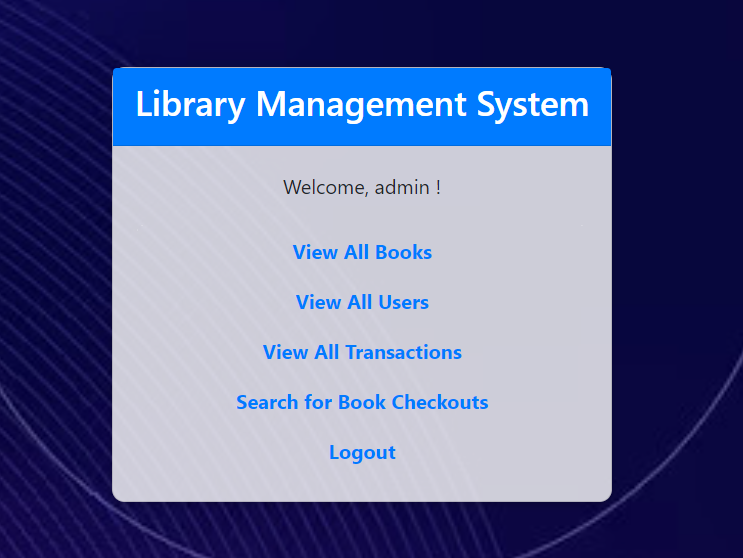

# Library_Management_System
The Library Management System is a web-based application that provides an interface for managing a small library.

It uses PHP for server-side scripting, MySQL for the database, HTML/CSS and bootstrap framework for the front end.
Here, is the dashboard for the system.

The system provides features for users to view all books, search for specific books, and check out books.
In addition, admins have the capability to insert new books, update book details, and delete books from the system.
The project also implements basic user authentication. Users must log in to access the system, and administrative features are hidden from regular users.

